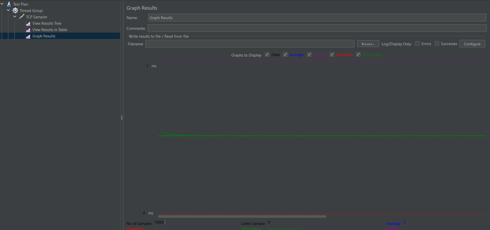
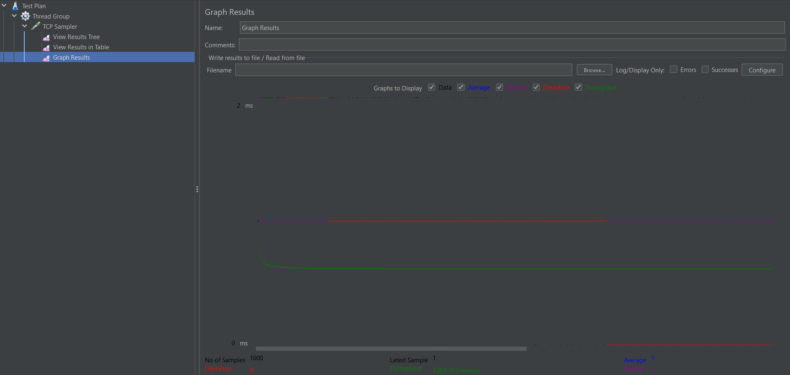

# Multithreaded Web Server (with Thread Pool)

This project demonstrates a basic web server implemented in Java that supports handling multiple client connections simultaneously using both **multithreading** and a **thread pool**. It is designed for learning and benchmarking concurrent server architectures using tools like **Apache JMeter**.

---

## 🧠 Key Features

- ✅ Accepts multiple client connections via sockets  
- 🧵 Supports both multithreaded and thread pool implementations  
- 🧪 Tested with JMeter for performance benchmarking  
- 🛠️ Clean and modular Java code using `ExecutorService`  
- 🔄 Gracefully handles socket timeouts and exceptions

---

## 🚀 Technologies Used

- Java (JDK 17+)
- Java Sockets (`ServerSocket`, `Socket`)
- Java Threads and `ExecutorService`
- Apache JMeter (for load testing)

---

## 🛠️ How It Works

- The server listens on a defined port (`9090`).
- On each client connection:
  - A new thread is either created (in multithreaded mode)
  - Or a thread is borrowed from a pool (`CachedThreadPool` or `FixedThreadPool`)
- Server sends a message to the client and optionally reads a response.
- Each connection is handled concurrently without blocking the server.

---

## 🧪 How to Test with JMeter

1. Open **Apache JMeter**.
2. Create a **Thread Group** (e.g., 2000 users ramp-up in 60 sec).
3. Add a **TCP Sampler**:
   - **Server Name:** `localhost`
   - **Port Number:** `9090`
   - **Send String:** `"Hello from JMeter"` (or any simple message)
4. Run the test and observe connection behavior.

---
## Graphs result



## 📁 Project Structure
```
MultithreadedWebServer/
├── multiThreaded/
│   ├── Client.java         # Client for multithreaded server
│   └── Server.java         # Server using new thread per client
├── ThreadPool/
│   ├── Client.java         # Client for thread pool server
│   └── Server.java         # Server using ExecutorService (thread pool)
├── README.md

```

---

## 🧩 Future Enhancements

- Add HTTP protocol support (currently plain TCP)
- Implement logging and connection metrics
- Add client-side GUI for interaction

---

## 🤔 Why I Built This

This project was created to:

- Learn how real-world servers handle concurrency
- Understand performance differences between thread-per-client vs thread pool models
- Benchmark server behavior under heavy loads using JMeter
- Sharpen core Java, networking, and multithreading concepts
